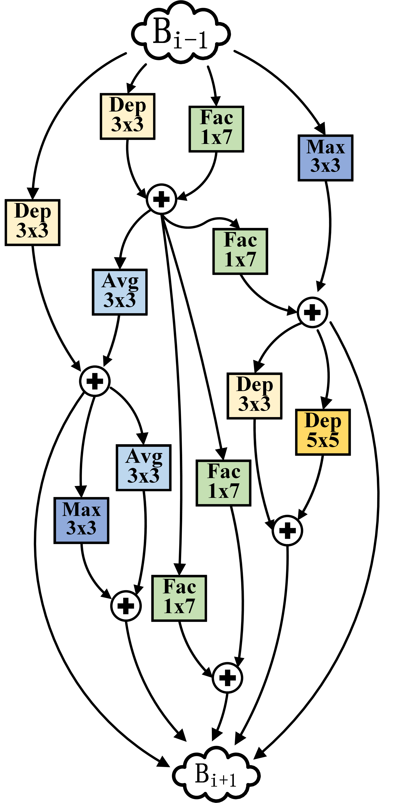

# Memory-Efficient Neural Architecture Search with Grow-Trim Learning

Illustration of our MemNAS

**(a) Flow Chart of the Proposed MemNAS.** It has mainly three steps: i) candidate neural network generation, ii) the top-$k$ candidate generation using the proposed structure correlation controller, and iii) candidate training and selection.

**(b) The Network Structure for CIFAR-10.** The neural network architecture has five blocks. Each block contains several cells with stride (S) 1 and 2. Each cell ($C_{i}$), shown in the gray background, is represented by a tuple of five binary vectors. $r_{i}$ represent the intermediate representations in one block.

**(c) Examples of Candidates by Growing and Trimming a base Network.** The cells in the gray background are newly added. The layers with the dashed outlines are removed. We remove only one layer or one edge only in a block when we trim a neural network. But we add the same cell to all five blocks when we grow in CIFAR-10.

## Intermediate searching results

## Results on Cifar-10
 

| Method | Type | Total Memory           | Memory Savings| Params Memory           | Top-1 Acc. (\%)             |
|-----------------------------------------------|--------|---------------------|-----------|---------------------|--------------------|
| MobileNet-V2 | manual | 16\.3MB            | 60\.7\% | 13\.9MB            | 94\.1              |
| ResNet\-110             | manual | 9\.9MB             | 41\.1\% | 6\.8MB             | 93\.5              |
| ResNet\-56              | manual | 6\.7MB             | 12\.4\% | 3\.4MB             | 93\.0              |
| ShuffleNet     | manual | 8\.3MB             | 30\.1\% | 3\.6MB             | 92\.2              |
| CondenseNet\-86 | manual | 8\.1MB             | 21\.0\% | 2\.1MB             | 94\.9              |
| CondenseNet\-50| manual | 6\.8MB             | 14\.7\% | 1\.0MB             | 93\.7              |
| DPPNet\-P      | auto   | 8\.1MB             | 28\.4\% | 2\.1MB             | 95\.3              |
| DPPNet\-M   | auto   | 7\.7MB             | 24\.7\% | 1\.8MB             | 94\.1              |
| **MemNAS ( \lambda =0\.5)**    | auto   | **5\.8MB** | \-     | **0\.8MB** | 94\.0              |
| **MemNAS (lambda=0\.8)**     | auto   | 6\.4MB             | \-      | 1\.8MB             | **95\.7** |

## Results on ImageNet
| Method | Type | Total Memory           | Memory Savings| Params Memory|Inference Latency           | Top-1 Acc. (\%)             |
|---------------------------------------------------------|--------|----------------------|-----------|----------------------|-------------------|--------------------|
| MobileNet V2 \(1\.4x\) | manual | 48\.5 MB             | 53\.0 \% | 21\.2 MB             | \-             | 74\.7              |
| MobileNet V2 \(1\.3x\)| manual | 40\.4 MB             | 43\.6 \% | 21\.2 MB             | \-              | 74\.4              |
| MobileNet V2 \(1\.0x\)| manual | 33\.1 MB             | 31\.1 \% | 13\.9 MB             | 75 ms             | 71\.8              |
| CondenseNet \(G=C=4\)| manual | 31\.6 MB             | 27\.8 \% | 19\.2 MB             | \-              | 73\.8              |
| CondenseNet \(G=C=8\)   | manual | 24\.4 MB             | 6\.6 \%  | 12\.0 MB             | \-              | 71\.0              |
| ShuffleNet V2 \(2\.0x\)    | manual | 51\.6 MB             | 55\.8 \%  | 23\.0 MB             | \-              | 74\.9              |
| ShuffleNet V2 \(1\.5x\)   | manual | 26\.1 MB             | 12\.6 \% | 14\.0 MB             | \-              | 72\.6              |
| ShuffleNet V1 \(1\.5x\) | manual | 25\.1 MB             | 9\.2 \%  | 13\.6 MB             | \-              | 71\.5              |
| EMNAS                    | auto   | 54\.0 MB             | 57\.8 \% | 16\.0 MB             | \-              | 71\.7              |
| NASNet \(Mobile\)         | auto   | 53\.2 MB             | 57\.1 \% | 21\.2 MB             | 183 ms            | 73\.5              |
| DVOLER\-B    | auto   | 37\.2 MB             | 38\.7 \% | 18\.9 MB             | \-              | 73\.7              |
| DVOLER\-A                 | auto   | 35\.9 MB             | 36\.5 \% | 18\.0 MB             | \-              | 73\.1              |
| MnasNet \(DM=1\)            | auto   | 36\.7 MB             | 37\.9 \% | 15\.6 MB             | 78 ms             | 75\.2              |
| MnasNet \(DM=0\.75\)         | auto   | 27\.4 MB             | 16\.8 \% | 11\.6 MB             | 61 ms             | 73\.3              |
| ProxylessNAS        | auto   | 36\.2 MB             | 37\.0 \% | 25\.0 MB             | 78 ms             | 74\.6              |
| FBNet\-C                         | auto   | 35\.2 MB             | 35\.2 \% | 18\.8 MB             | \-              | 74\.9              |
| FBNet\-B                         | auto   | 28\.0 MB             | 16\.5\%  | 18\.0 MB             | \-              | 74\.1              |
| FBNet\-A                       | auto   | 29\.0 MB             | 21\.4 \% | 17\.2 MB             | \-              | 73\.0              |
| DPPNet\-P \(PPPNet\)      | auto   | 34\.7 MB             | 34\.3 \% | 19\.2 MB             | \-              | 74\.0              |
| DARTS                           | auto   | 31\.0 MB             | 26\.5 \% | 18\.8 MB             | \-              | 73\.3              |
| **MemNAS\-A \(ours\)**                          | auto   | **22\.8 MB** | \-      | **10\.3 MB** | **58 ms** | 74\.1              |
| **MemNAS\-B \(ours\)**                          | auto   | 28\.1 MB             | \-      | 14\.8 MB             | 69 ms             | **75\.4** |

## Run
