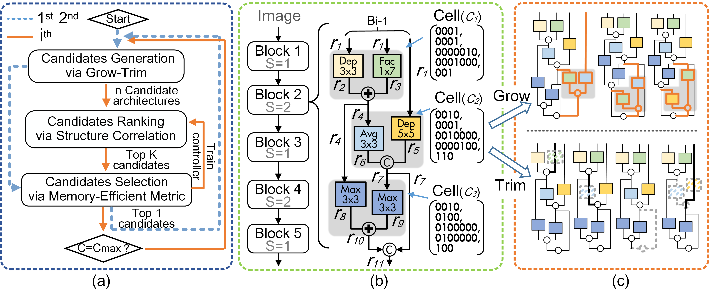

# Memory-Efficient Neural Architecture Search with Grow-Trim Learning

Illustration of our MemNAS

**(a) Flow Chart of the Proposed MemNAS.** It has mainly three steps: i) candidate neural network generation, ii) the top-$k$ candidate generation using the proposed structure correlation controller, and iii) candidate training and selection.

**(b) The Network Structure for CIFAR-10.** The neural network architecture has five blocks. Each block contains several cells with stride (S) 1 and 2. Each cell ($C_{i}$), shown in the gray background, is represented by a tuple of five binary vectors. $r_{i}$ represent the intermediate representations in one block.

**(c) Examples of Candidates by Growing and Trimming a base Network.** The cells in the gray background are newly added. The layers with the dashed outlines are removed. We remove only one layer or one edge only in a block when we trim a neural network. But we add the same cell to all five blocks when we grow in CIFAR-10.
## Run

## Results on Cifar-10
| Method | Type | Total Memory           | Memory Savings| Params Memory           | Top-1 Acc. (\%)             |
|-----------------------------------------------|--------|---------------------|-----------|---------------------|--------------------|
| MobileNet-V2 | manual | 16\.3MB            | 60\.7\% | 13\.9MB            | 94\.1              |
| ResNet\-110             | manual | 9\.9MB             | 41\.1\% | 6\.8MB             | 93\.5              |
| ResNet\-56              | manual | 6\.7MB             | 12\.4\% | 3\.4MB             | 93\.0              |
| ShuffleNet     | manual | 8\.3MB             | 30\.1\% | 3\.6MB             | 92\.2              |
| CondenseNet\-86 | manual | 8\.1MB             | 21\.0\% | 2\.1MB             | 94\.9              |
| CondenseNet\-50| manual | 6\.8MB             | 14\.7\% | 1\.0MB             | 93\.7              |
| DPPNet\-P      | auto   | 8\.1MB             | 28\.4\% | 2\.1MB             | 95\.3              |
| DPPNet\-M   | auto   | 7\.7MB             | 24\.7\% | 1\.8MB             | 94\.1              |
| MemNAS (lambda=0\.5)      | auto   | **5\.8MB** | \-     | **0\.8MB** | 94\.0              |
| MemNAS (lambda=0\.8)       | auto   | 6\.4MB             | \-      | 1\.8MB             | **95\.7** |

## Results on ImageNet
